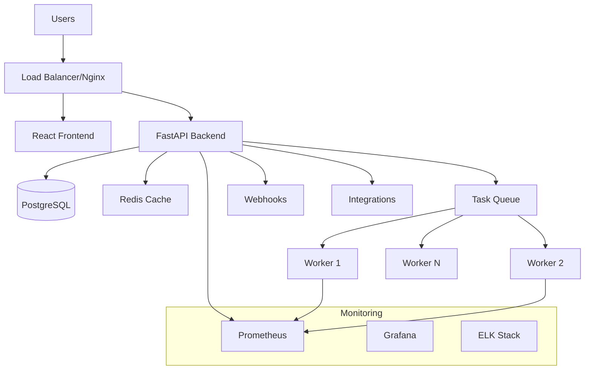
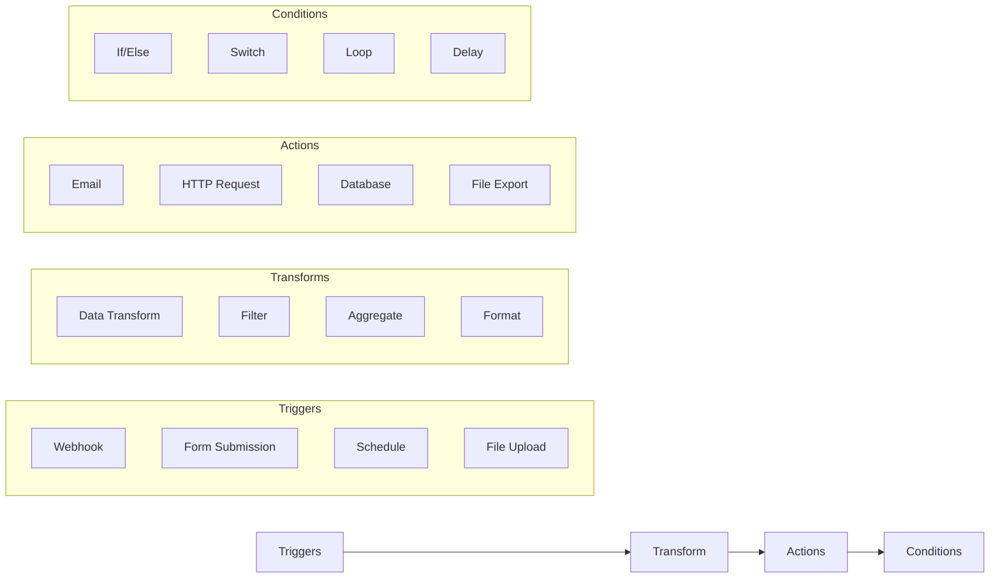
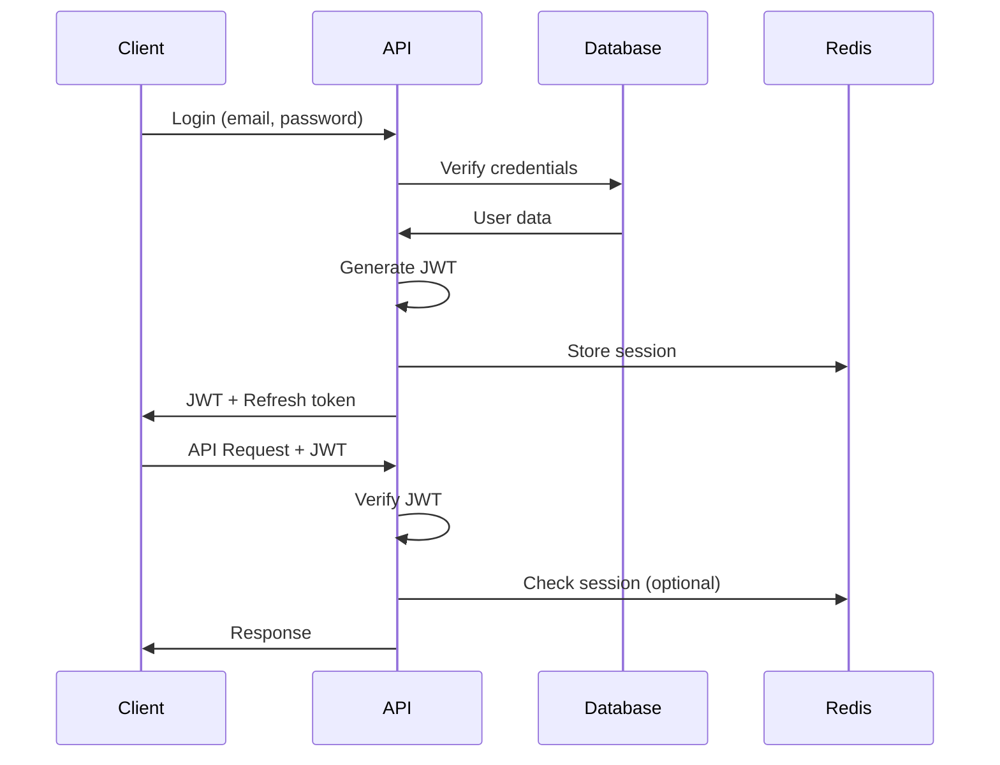
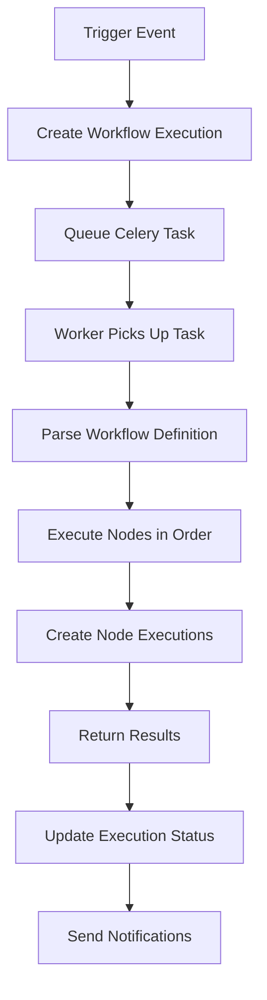
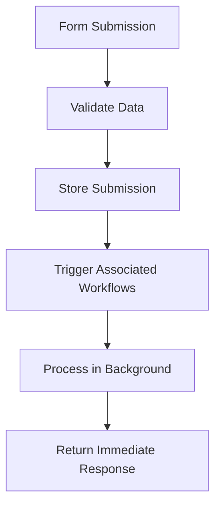

# ConcertMaster Architecture Documentation

## 🎯 Overview

ConcertMaster is a modern data orchestration platform that provides visual workflow building capabilities with a focus on scalability, extensibility, and enterprise-grade reliability.

## 🏗️ System Architecture

### High-Level Architecture



### Core Components

#### 1. Frontend (React + React Flow)
- **Technology**: React 18, TypeScript, Vite
- **UI Framework**: Tailwind CSS
- **Workflow Engine**: React Flow for visual workflow building
- **State Management**: Zustand + React Query
- **Features**:
  - Drag-and-drop workflow builder
  - Real-time execution monitoring
  - Form builder with dynamic validation
  - Responsive design with dark/light themes

#### 2. Backend (FastAPI + SQLAlchemy)
- **Framework**: FastAPI with async/await support
- **Database ORM**: SQLAlchemy 2.0 with async support
- **Authentication**: JWT-based with bcrypt password hashing
- **API Documentation**: Auto-generated OpenAPI/Swagger
- **Features**:
  - RESTful API design
  - Async request handling
  - Comprehensive input validation
  - Role-based access control

#### 3. Database (PostgreSQL)
- **Schema Design**: Multi-tenant with organization isolation
- **Extensions**: UUID, Full-text search, JSON support
- **Features**:
  - ACID compliance
  - Audit trail tracking
  - Performance metrics storage
  - Automatic backups

#### 4. Task Processing (Celery + Redis)
- **Message Broker**: Redis
- **Task Queue**: Celery with custom task routing
- **Worker Scaling**: Horizontal scaling support
- **Features**:
  - Async workflow execution
  - Task prioritization
  - Retry mechanisms
  - Real-time progress tracking

## 🔌 Plugin System Architecture

### Node Types



### Plugin Development

1. **Base Node Class**: All plugins extend `BaseNode`
2. **Configuration Schema**: JSON Schema for node configuration
3. **Execution Model**: Async execution with context passing
4. **Error Handling**: Comprehensive error reporting and recovery

### Built-in Nodes

| Category | Node Type | Description |
|----------|-----------|-------------|
| Triggers | Webhook | HTTP endpoint trigger |
| Triggers | Form | Form submission trigger |
| Transform | Data Transform | JSON/data manipulation |
| Action | Email | Send email notifications |
| Condition | If/Else | Conditional branching |

## 🗄️ Database Schema

### Core Tables

#### Users & Organizations
```sql
users (id, email, username, password_hash, ...)
organizations (id, name, slug, settings, ...)
user_organizations (user_id, organization_id, role, permissions)
```

#### Workflows
```sql
workflows (id, name, definition, status, organization_id, ...)
workflow_node_types (id, name, category, schema, ...)
workflow_executions (id, workflow_id, status, trigger_data, ...)
node_executions (id, workflow_execution_id, node_id, status, ...)
```

#### Forms & Submissions
```sql
forms (id, name, schema, settings, organization_id, ...)
form_submissions (id, form_id, data, status, ...)
```

#### Integrations
```sql
integrations (id, name, type, configuration, organization_id, ...)
webhooks (id, workflow_id, url_path, secret_key, ...)
```

### Indexing Strategy

1. **Primary Keys**: UUID for all entities
2. **Search Indexes**: Full-text search on names and descriptions
3. **Performance Indexes**: Execution queries, user lookups
4. **Composite Indexes**: Organization + status queries

## 🔒 Security Architecture

### Authentication Flow



### Security Features

1. **Password Security**: bcrypt hashing with salt
2. **JWT Tokens**: Access + refresh token pattern
3. **Session Management**: Redis-based session storage
4. **Rate Limiting**: Request throttling per user/IP
5. **Input Validation**: Pydantic models for all inputs
6. **CORS**: Configurable origin whitelist
7. **Webhook Security**: HMAC signature validation

### Authorization Model

- **Multi-tenant**: Organization-level isolation
- **Role-based**: Owner, Admin, Member, Viewer roles
- **Resource-level**: Per-workflow permissions
- **API Security**: All endpoints require authentication

## 🚀 Deployment Architecture

### Docker Composition

```yaml
Services:
  - postgres (Database)
  - redis (Cache + Message Broker)
  - backend (FastAPI Application)
  - celery-worker (Task Workers)
  - celery-beat (Scheduler)
  - flower (Task Monitor)
  - frontend (React Application)
  - nginx (Reverse Proxy)
```

### Environment Configurations

#### Development
- Hot reload for backend and frontend
- Debug logging enabled
- Local file storage
- Development SMTP (Mailhog)

#### Production
- Optimized builds with multi-stage Docker
- Nginx reverse proxy with SSL
- Production database settings
- Monitoring stack (Prometheus + Grafana)

### Scaling Strategy

1. **Horizontal Scaling**:
   - Multiple backend instances behind load balancer
   - Celery workers can be scaled independently
   - Database read replicas for performance

2. **Vertical Scaling**:
   - Configurable worker concurrency
   - Database connection pooling
   - Redis clustering support

## 📊 Monitoring & Observability

### Metrics Collection

1. **Application Metrics**:
   - Request/response times
   - Error rates and types
   - Workflow execution statistics
   - User activity tracking

2. **Infrastructure Metrics**:
   - CPU, Memory, Disk usage
   - Database performance
   - Cache hit/miss rates
   - Task queue lengths

3. **Business Metrics**:
   - Workflow success rates
   - User engagement
   - System utilization
   - Performance trends

### Logging Strategy

- **Structured Logging**: JSON format with correlation IDs
- **Log Levels**: Debug, Info, Warning, Error, Critical
- **Centralized Collection**: ELK stack for log aggregation
- **Audit Trail**: Complete change tracking in database

## 🔧 Configuration Management

### Environment Variables

```bash
# Database
DATABASE_URL=postgresql+asyncpg://...
DB_POOL_SIZE=20

# Redis
REDIS_URL=redis://localhost:6379/0
CACHE_TTL=3600

# Security
SECRET_KEY=your-secret-key
JWT_EXPIRATION_HOURS=24

# Celery
CELERY_BROKER_URL=redis://localhost:6379/1
CELERY_TASK_TIMEOUT=300

# Integration
EMAIL_HOST=smtp.example.com
WEBHOOK_SECRET=webhook-secret
```

### Feature Flags

- Development vs. Production modes
- Feature toggles for new capabilities
- A/B testing support
- Gradual rollout controls

## 🔄 Data Flow

### Workflow Execution Flow



### Form Processing Flow



## 🧩 Integration Points

### Webhook System
- Unique URLs per workflow
- HMAC signature validation
- Retry mechanisms
- Rate limiting

### Email Integration
- SMTP configuration
- Template system
- Attachment support
- Delivery tracking

### External APIs
- HTTP client with timeout/retry
- Authentication handling
- Response caching
- Error handling

### File Handling
- Upload size limits
- Type validation
- Storage backends
- Processing queues

## 📈 Performance Considerations

### Backend Optimization
- Async/await throughout
- Database connection pooling
- Query optimization with indexes
- Response caching with Redis

### Frontend Optimization
- Code splitting and lazy loading
- Virtual scrolling for large lists
- Optimistic updates
- Service worker for caching

### Database Optimization
- Proper indexing strategy
- Query analysis and optimization
- Connection pooling
- Read replicas for scaling

### Caching Strategy
- Redis for session storage
- Application-level caching
- Database query result caching
- CDN for static assets

## 🔮 Future Architecture Considerations

### Microservices Migration
- Service decomposition strategy
- API gateway implementation
- Service mesh for communication
- Distributed tracing

### Event Sourcing
- Event store implementation
- CQRS pattern adoption
- Replay capabilities
- Audit trail enhancement

### Real-time Features
- WebSocket connections
- Server-sent events
- Real-time collaboration
- Live execution monitoring

### AI/ML Integration
- Workflow optimization suggestions
- Anomaly detection
- Predictive analytics
- Natural language workflow creation