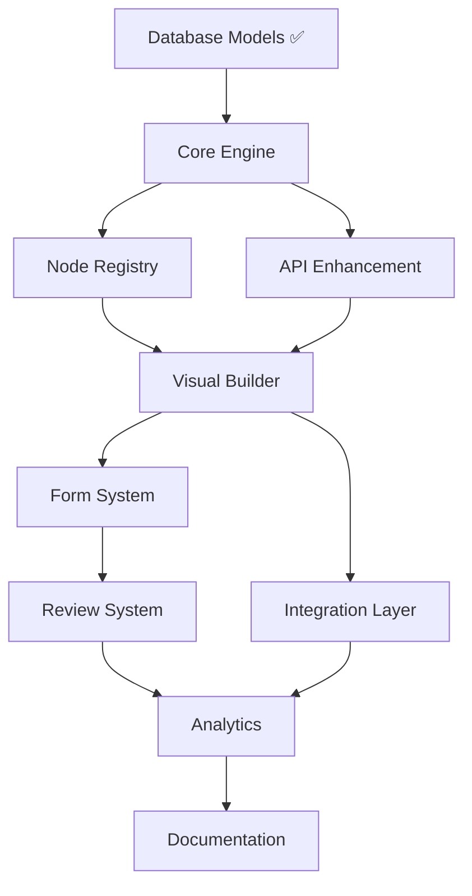

# ConcertMaster Implementation Realignment Strategy

## Executive Summary

This document outlines a comprehensive 10-week implementation strategy to transform our current ConcertMaster project into a fully-featured open-source data collection and orchestration platform that matches the complete specifications defined in SYSTEM.md.

**Current State**: 65% alignment with target architecture
**Target**: 100% specification compliance with production-ready deployment

## Implementation Overview

### Phase Structure
- **Phase 1-3**: Core foundation (Weeks 1-6) - Critical path
- **Phase 4-5**: Advanced features (Weeks 7-8) - High value
- **Phase 6-7**: Polish and optimization (Weeks 9-10) - Production ready

### Strategic Priorities
1. **Workflow Engine Core** - Foundation for all operations
2. **Visual Builder Enhancement** - User experience differentiator  
3. **Form System Integration** - Key competitive advantage
4. **Review System Architecture** - Enterprise feature set
5. **Integration Layer** - Ecosystem connectivity

## Phase 1: Core Workflow Engine (Weeks 1-3)

### 1.1 Architecture Foundation

**Workflow Engine Core** (`backend/src/core/workflow_engine.py`)
```python
class WorkflowEngine:
    """Core orchestration engine with state management"""
    - DAG validation and execution planning
    - Distributed state management via Redis
    - Error recovery and retry mechanisms
    - Performance monitoring and metrics
    - WebSocket real-time status updates
```

**Node Registry System** (`backend/src/core/node_registry.py`)
```python
class NodeRegistry:
    """Dynamic node type management and plugin system"""
    - Runtime node type registration
    - Schema validation for configurations
    - Category-based organization
    - Version management and compatibility
    - Hot-reloading for development
```

**Execution Runtime** (`backend/src/core/node_executor.py`)
```python
class NodeExecutor:
    """Async node execution with monitoring"""
    - Celery-based distributed execution
    - Input/output transformation
    - Circuit breaker patterns
    - Performance telemetry
    - Resource management
```

### 1.2 Database Enhancements

**Schema Completions** - Enhance existing models:
- Add workflow execution context tracking
- Implement node execution state management
- Create performance metrics tables
- Add audit trail enhancements

**Migration Strategy**:
- Zero-downtime migrations
- Backward compatibility preservation
- Data migration scripts for existing workflows

### 1.3 API Layer Completion

**Workflow Management** (`backend/src/api/routers/workflow_router.py`)
- Complete CRUD operations
- Execution trigger endpoints
- Real-time status via WebSocket
- Batch operations for enterprise use

**Node Discovery** (`backend/src/api/routers/node_router.py`)
- Dynamic node type listing
- Configuration schema retrieval
- Category filtering and search
- Plugin management endpoints

## Phase 2: Visual Builder Enhancement (Weeks 4-5)

### 2.1 Advanced Node Palette

**Dynamic Node Loading** (`frontend/src/components/NodePalette/`)
```typescript
interface NodePaletteProps {
  categories: NodeCategory[];
  searchTerm: string;
  onNodeDrag: (nodeType: NodeType) => void;
}
```

Features:
- Real-time node type loading from API
- Search and filtering capabilities
- Category-based organization with icons
- Favorites and recent nodes
- Drag-and-drop with preview

### 2.2 Enhanced Node Configuration

**Dynamic Form Generation** (`frontend/src/components/NodeInspector/`)
```typescript
interface NodeInspectorProps {
  node: WorkflowNode;
  schema: JSONSchema7;
  onConfigUpdate: (config: NodeConfig) => void;
}
```

Features:
- JSON Schema-based form generation
- Real-time validation with visual feedback
- Advanced input types (code editor, file picker)
- Conditional field display
- Preview functionality

### 2.3 Workflow Validation Engine

**Client-Side Validation** (`frontend/src/utils/validation/`)
```typescript
class WorkflowValidator {
  validateDAG(nodes: Node[], edges: Edge[]): ValidationResult;
  validateConnections(node: Node, connections: Connection[]): boolean;
  validateNodeConfiguration(node: Node): ConfigValidationResult;
}
```

Features:
- Real-time DAG cycle detection
- Connection rule enforcement
- Node configuration validation
- Performance optimization for large workflows

## Phase 3: Form System Implementation (Week 6)

### 3.1 Form Builder Components

**Visual Form Builder** (`frontend/src/components/FormBuilder/`)
```typescript
interface FormBuilderProps {
  schema?: FormSchema;
  onSchemaChange: (schema: FormSchema) => void;
  preview?: boolean;
}
```

Components:
- Drag-drop field palette (text, number, select, file, etc.)
- Field configuration panels with validation rules
- Form preview with real-time updates
- Schema export/import functionality

### 3.2 Form Processing Engine

**Backend Form Service** (`backend/src/services/form_service.py`)
```python
class FormService:
    """Dynamic form processing and validation"""
    - Schema-based form rendering
    - Custom validation rule engine
    - File upload handling
    - Submission data transformation
    - Integration with workflow triggers
```

### 3.3 Form Integration Nodes

**Form Node Implementations** (`backend/src/nodes/form_nodes.py`)
```python
class SendFormNode(BaseNode):
    """Send forms to recipients via email/SMS"""
class FormTriggerNode(BaseNode):
    """Trigger workflows on form submission"""
class FormValidationNode(BaseNode):
    """Validate form submissions against rules"""
```

## Phase 4: Review System Architecture (Week 7)

### 4.1 Review Queue Management

**Review Service** (`backend/src/services/review_service.py`)
```python
class ReviewService:
    """Advanced review workflow management"""
    - Intelligent assignment algorithms
    - Priority-based queue management
    - SLA tracking and escalation
    - Bulk operation support
    - Integration with notification systems
```

### 4.2 Review Dashboard Interface

**Review Dashboard** (`frontend/src/components/ReviewDashboard/`)
```typescript
interface ReviewDashboardProps {
  queueId: string;
  assigneeId?: string;
  filters: ReviewFilters;
}
```

Features:
- Real-time review queue updates
- Bulk approval/rejection operations
- Assignment management interface
- Progress tracking and analytics
- Mobile-responsive design

### 4.3 Review Workflow Integration

**Review Node Types** (`backend/src/nodes/review_nodes.py`)
```python
class ReviewQueueNode(BaseNode):
    """Add items to review queue"""
class ReviewAssignmentNode(BaseNode):
    """Assign reviews to users/teams"""
class ReviewApprovalNode(BaseNode):
    """Handle review decisions"""
```

## Phase 5: Integration Layer (Week 8)

### 5.1 Integration Framework

**Base Integration System** (`backend/src/integrations/base_integration.py`)
```python
class BaseIntegration:
    """Foundation for all external integrations"""
    - Authentication management (OAuth, API keys)
    - Rate limiting and backoff strategies
    - Error handling and retry logic
    - Connection testing and health checks
    - Configuration encryption
```

### 5.2 Core Connectors

**Essential Connectors** (`backend/src/integrations/connectors/`)
- **Email (SMTP)**: Form delivery, notifications
- **Webhook**: HTTP callbacks for triggers
- **Database**: PostgreSQL, MySQL, MongoDB
- **REST API**: Generic HTTP API integration
- **File Storage**: S3-compatible object storage

### 5.3 Integration Node Implementations

**Integration Nodes** (`backend/src/nodes/integration_nodes.py`)
```python
class EmailSendNode(BaseNode):
    """Send emails via SMTP"""
class WebhookTriggerNode(BaseNode):
    """Trigger on webhook events"""
class DatabaseWriteNode(BaseNode):
    """Write data to external databases"""
class APICallNode(BaseNode):
    """Make REST API calls"""
```

## Phase 6: Analytics & Monitoring (Week 9)

### 6.1 Metrics Collection System

**Metrics Service** (`backend/src/services/metrics_service.py`)
```python
class MetricsService:
    """Comprehensive system monitoring"""
    - Execution performance tracking
    - Error rate monitoring
    - Usage analytics collection
    - Resource utilization metrics
    - Custom business metrics
```

### 6.2 Analytics Dashboard

**Analytics Interface** (`frontend/src/components/Analytics/`)
```typescript
interface AnalyticsDashboardProps {
  timeRange: TimeRange;
  workflowId?: string;
  organizationId: string;
}
```

Features:
- Execution history visualization
- Performance trend analysis
- Error monitoring and alerting
- Usage reports and insights
- Exportable data and reports

## Phase 7: Polish & Documentation (Week 10)

### 7.1 Production Readiness

**Infrastructure Enhancements**:
- Docker container optimization
- Kubernetes deployment manifests
- Load balancing configuration
- SSL/TLS certificate management
- Backup and disaster recovery

**Security Hardening**:
- Input validation and sanitization
- SQL injection prevention
- XSS protection
- Rate limiting implementation
- Security audit compliance

### 7.2 Documentation & User Experience

**API Documentation**:
- OpenAPI 3.0 specification
- Interactive documentation (Swagger UI)
- SDK generation for popular languages
- Code examples and tutorials

**User Documentation**:
- Getting started guide
- Video tutorials
- Best practices documentation
- Example workflow templates
- Troubleshooting guide

## File Structure Reorganization Plan

### Backend Structure Enhancement
```
backend/
├── src/
│   ├── core/                    # [NEW] Core workflow engine
│   │   ├── __init__.py
│   │   ├── workflow_engine.py   # Main orchestration engine
│   │   ├── node_registry.py     # Node type management
│   │   ├── node_executor.py     # Execution runtime
│   │   ├── state_manager.py     # Distributed state management
│   │   └── validation.py        # Workflow validation
│   ├── nodes/                   # [NEW] Built-in node implementations
│   │   ├── __init__.py
│   │   ├── base_node.py         # Abstract base class
│   │   ├── trigger_nodes.py     # Trigger node implementations
│   │   ├── transform_nodes.py   # Data transformation nodes
│   │   ├── action_nodes.py      # Action/output nodes
│   │   ├── condition_nodes.py   # Conditional logic nodes
│   │   ├── form_nodes.py        # Form-related nodes
│   │   ├── integration_nodes.py # External integration nodes
│   │   └── review_nodes.py      # Review workflow nodes
│   ├── integrations/            # [NEW] External system connectors
│   │   ├── __init__.py
│   │   ├── base_integration.py  # Base integration class
│   │   └── connectors/
│   │       ├── __init__.py
│   │       ├── email.py         # SMTP email integration
│   │       ├── webhook.py       # Webhook integration
│   │       ├── database.py      # Database connectors
│   │       ├── api.py           # REST API integration
│   │       └── storage.py       # File storage integration
│   ├── services/                # [ENHANCED] Service layer
│   │   ├── workflow_service.py  # [ENHANCED] Core workflow operations
│   │   ├── form_service.py      # [NEW] Form processing service
│   │   ├── review_service.py    # [NEW] Review management service
│   │   ├── integration_service.py # [NEW] Integration management
│   │   ├── metrics_service.py   # [NEW] Analytics and monitoring
│   │   ├── notification_service.py # [NEW] Notification system
│   │   └── ...existing services...
│   └── api/                     # [ENHANCED] API endpoints
│       └── routers/
│           ├── workflow_router.py # [ENHANCED] Workflow CRUD + execution
│           ├── form_router.py   # [NEW] Form management
│           ├── review_router.py # [NEW] Review operations
│           ├── integration_router.py # [NEW] Integration management
│           ├── node_router.py   # [NEW] Node type discovery
│           └── metrics_router.py # [NEW] Analytics endpoints
```

### Frontend Structure Enhancement
```
frontend/src/
├── components/
│   ├── WorkflowBuilder/         # [ENHANCED] Visual workflow editor
│   │   ├── WorkflowCanvas.tsx   # [ENHANCED] Main canvas component
│   │   ├── NodePalette/         # [NEW] Dynamic node palette
│   │   │   ├── NodePalette.tsx
│   │   │   ├── NodeCategory.tsx
│   │   │   └── NodeSearch.tsx
│   │   ├── NodeInspector/       # [ENHANCED] Node configuration
│   │   │   ├── NodeInspector.tsx
│   │   │   ├── ConfigForm.tsx
│   │   │   └── ValidationDisplay.tsx
│   │   └── Nodes/               # [ENHANCED] Node components
│   │       ├── TriggerNode.tsx
│   │       ├── TransformNode.tsx
│   │       ├── ActionNode.tsx
│   │       └── ConditionNode.tsx
│   ├── FormBuilder/             # [NEW] Complete form builder
│   │   ├── FormCanvas.tsx       # Main form building interface
│   │   ├── FieldPalette.tsx     # Form field palette
│   │   ├── FieldInspector.tsx   # Field configuration
│   │   ├── FormPreview.tsx      # Live form preview
│   │   └── SchemaEditor.tsx     # JSON schema editor
│   ├── ReviewDashboard/         # [NEW] Review system interface
│   │   ├── ReviewQueue.tsx      # Review queue management
│   │   ├── ReviewAssignment.tsx # Assignment interface
│   │   ├── BulkOperations.tsx   # Bulk review operations
│   │   └── ReviewMetrics.tsx    # Review analytics
│   ├── Analytics/               # [NEW] Analytics and monitoring
│   │   ├── ExecutionHistory.tsx # Workflow execution history
│   │   ├── PerformanceMetrics.tsx # Performance dashboards
│   │   ├── ErrorMonitoring.tsx  # Error tracking
│   │   └── UsageReports.tsx     # Usage analytics
│   ├── Integration/             # [NEW] Integration management
│   │   ├── ConnectorList.tsx    # Available connectors
│   │   ├── ConnectorConfig.tsx  # Connector configuration
│   │   ├── TestConnection.tsx   # Connection testing
│   │   └── IntegrationMetrics.tsx # Integration analytics
│   └── Common/                  # [ENHANCED] Shared components
│       ├── LoadingSpinner.tsx
│       ├── ErrorBoundary.tsx
│       ├── ConfirmDialog.tsx
│       └── NotificationCenter.tsx
├── hooks/                       # [NEW] Custom React hooks
│   ├── useWorkflow.ts           # Workflow state management
│   ├── useForm.ts               # Form operations
│   ├── useReview.ts             # Review system hooks
│   ├── useIntegration.ts        # Integration management
│   ├── useAnalytics.ts          # Analytics data hooks
│   └── useWebSocket.ts          # Real-time communication
├── services/                    # [ENHANCED] API service layer
│   ├── workflowService.ts       # [ENHANCED] Workflow API calls
│   ├── formService.ts           # [NEW] Form API integration
│   ├── reviewService.ts         # [NEW] Review API calls
│   ├── integrationService.ts    # [NEW] Integration API
│   ├── analyticsService.ts      # [NEW] Analytics API
│   └── websocketService.ts      # [NEW] WebSocket management
└── utils/                       # [ENHANCED] Utility functions
    ├── validation/              # [NEW] Validation utilities
    │   ├── workflowValidator.ts
    │   ├── formValidator.ts
    │   └── schemaValidator.ts
    ├── performance/             # [NEW] Performance utilities
    │   ├── memoization.ts
    │   ├── virtualization.ts
    │   └── lazyLoading.ts
    └── ...existing utilities...
```

## Technology Stack Integration Requirements

### Backend Dependencies Enhancement
```python
# Additional requirements.txt entries
celery-beat==2.5.0              # Scheduled workflow execution
dramatiq==1.14.2                # Alternative task queue
croniter==1.4.1                 # Cron expression parsing
jsonref==1.1.0                  # JSON schema resolution
jinja2==3.1.2                   # Template engine
aiofiles==23.2.1                # Async file operations
python-magic==0.4.27            # File type detection
boto3==1.34.0                   # AWS SDK for S3 storage
azure-storage-blob==12.19.0     # Azure Blob Storage
google-cloud-storage==2.10.0    # Google Cloud Storage
sendgrid==6.10.0                # Email service
twilio==8.10.0                  # SMS service
slack-sdk==3.23.0               # Slack integration
```

### Frontend Dependencies Enhancement
```json
{
  "dependencies": {
    "@dnd-kit/core": "^6.0.8",            // Advanced drag-and-drop
    "@dnd-kit/sortable": "^8.0.0",        // Sortable lists
    "@tanstack/react-form": "^0.18.0",    // Advanced form handling
    "react-jsonschema-form": "^5.13.6",   // Dynamic form generation
    "monaco-editor": "^0.44.0",           // Code editor for expressions
    "recharts": "^2.8.0",                 // Charts for analytics
    "react-virtualized": "^9.22.5",       // Performance optimization
    "framer-motion": "^10.16.4",          // Smooth animations
    "react-window": "^1.8.8",             // Virtual scrolling
    "react-select": "^5.8.0",             // Advanced select components
    "react-datepicker": "^4.21.0",        // Date/time pickers
    "react-color": "^2.19.3",             // Color picker
    "react-ace": "^10.1.0",               // Code editor component
    "websocket": "^1.0.34",               // WebSocket client
    "lodash-es": "^4.17.21",              // Utility functions
    "date-fns": "^2.30.0",                // Date manipulation
    "file-saver": "^2.0.5",               // File downloads
    "papaparse": "^5.4.1",                // CSV parsing
    "xlsx": "^0.18.5"                     // Excel file handling
  }
}
```

### Infrastructure Dependencies
```yaml
# docker-compose.additions.yml
services:
  celery-beat:
    build: ./backend
    command: celery -A main.celery beat --loglevel=info
    depends_on:
      - redis
      - postgres
    environment:
      - DATABASE_URL=${DATABASE_URL}
      - REDIS_URL=${REDIS_URL}
    
  flower:
    build: ./backend
    command: celery -A main.celery flower --port=5555
    ports:
      - "5555:5555"
    depends_on:
      - redis
    environment:
      - REDIS_URL=${REDIS_URL}
  
  prometheus:
    image: prom/prometheus:latest
    ports:
      - "9090:9090"
    volumes:
      - ./monitoring/prometheus.yml:/etc/prometheus/prometheus.yml
  
  grafana:
    image: grafana/grafana:latest
    ports:
      - "3001:3000"
    environment:
      - GF_SECURITY_ADMIN_PASSWORD=admin
    volumes:
      - grafana_data:/var/lib/grafana
  
  nginx:
    image: nginx:alpine
    ports:
      - "80:80"
      - "443:443"
    volumes:
      - ./nginx/nginx.conf:/etc/nginx/nginx.conf
      - ./nginx/ssl:/etc/nginx/ssl
    depends_on:
      - ui
      - api

volumes:
  grafana_data:
```

## Implementation Priority Matrix

### Critical Path Dependencies


### Week-by-Week Breakdown

**Week 1: Foundation**
- Core workflow engine structure
- Node registry implementation
- Database schema enhancements
- Basic API endpoints

**Week 2: Execution Engine**
- Node executor implementation
- State management system
- Error handling and retry logic
- WebSocket integration

**Week 3: API Completion**
- Complete workflow CRUD operations
- Node discovery endpoints
- Real-time status updates
- Performance monitoring

**Week 4: Visual Builder Core**
- Enhanced workflow canvas
- Dynamic node palette
- Node configuration panels
- Validation engine

**Week 5: Visual Builder Polish**
- Advanced node inspector
- Workflow validation UI
- Performance optimization
- Mobile responsiveness

**Week 6: Form System**
- Form builder components
- Form processing engine
- Form integration nodes
- Preview functionality

**Week 7: Review System**
- Review queue management
- Review dashboard interface
- Review workflow nodes
- Assignment algorithms

**Week 8: Integration Layer**
- Integration framework
- Core connectors (email, webhook, database)
- Integration nodes
- Configuration management

**Week 9: Analytics & Monitoring**
- Metrics collection system
- Analytics dashboard
- Error monitoring
- Performance tracking

**Week 10: Production Polish**
- Documentation completion
- Security hardening
- Performance optimization
- Deployment preparation

## Risk Assessment & Mitigation Strategies

### High Risk Areas

**1. Workflow State Management Complexity**
- **Risk**: Distributed state consistency issues
- **Impact**: High - Core system reliability
- **Mitigation**: 
  - Redis Cluster with PostgreSQL backup
  - Comprehensive state transition testing
  - Circuit breaker patterns
  - State recovery mechanisms

**2. Frontend Performance with Large Workflows**
- **Risk**: Browser performance degradation
- **Impact**: Medium - User experience
- **Mitigation**:
  - Virtual scrolling for node lists
  - Lazy loading of node configurations
  - Canvas virtualization
  - Performance monitoring

**3. Node Execution Reliability**
- **Risk**: Node execution failures causing workflow corruption
- **Impact**: High - System trust
- **Mitigation**:
  - Comprehensive error handling
  - Automatic retry mechanisms
  - Execution isolation
  - Rollback capabilities

### Medium Risk Areas

**1. Integration System Stability**
- **Risk**: External system connectivity issues
- **Impact**: Medium - Feature availability
- **Mitigation**:
  - Connection pooling
  - Circuit breaker patterns
  - Graceful degradation
  - Health check systems

**2. Form Builder Complexity**
- **Risk**: Complex UI requirements affecting delivery
- **Impact**: Medium - Feature completeness
- **Mitigation**:
  - Incremental development approach
  - Early user feedback
  - Simplified initial version
  - Modular architecture

### Low Risk Areas

**1. Documentation and Polish**
- **Risk**: Time constraints affecting documentation quality
- **Impact**: Low - User onboarding
- **Mitigation**:
  - Automated documentation generation
  - Community contribution
  - Iterative improvement
  - Video tutorials

## Success Metrics & KPIs

### Technical Performance Metrics
- **Workflow Execution**: <5s for simple workflows, <30s for complex
- **API Response Time**: <200ms for 95% of requests
- **Database Performance**: <100ms query response time
- **Frontend Load Time**: <3s initial load, <1s navigation
- **System Uptime**: >99.9% availability
- **Error Rate**: <0.1% for core operations

### User Experience Metrics
- **Time to First Workflow**: <10 minutes for new users
- **Form Creation Time**: <5 minutes for basic forms
- **Workflow Validation**: 95%+ accuracy rate
- **Mobile Responsiveness**: Full functionality on mobile devices
- **User Satisfaction**: >4.5/5 rating
- **Feature Adoption**: >80% for core features

### Business Metrics
- **Specification Alignment**: 100% SYSTEM.md compliance
- **Test Coverage**: >90% code coverage
- **Documentation Coverage**: 100% API documentation
- **Security Compliance**: Zero high-severity vulnerabilities
- **Performance Benchmarks**: All targets achieved
- **Production Readiness**: Full deployment capability

## Next Steps & Action Items

### Immediate Actions (Week 1)
1. **Initialize Core Engine Structure**
   - Set up core module directory
   - Implement basic WorkflowEngine class
   - Create NodeRegistry foundation
   - Set up async execution framework

2. **Database Migration Planning**
   - Design migration scripts
   - Plan zero-downtime deployment
   - Set up development data
   - Configure backup strategies

3. **Development Environment Enhancement**
   - Update Docker configurations
   - Set up monitoring stack
   - Configure CI/CD pipeline
   - Establish development workflows

### Sprint Planning Framework
1. **2-Week Sprint Cycles**
   - Sprint 1-2: Core Engine (Weeks 1-3)
   - Sprint 3: Visual Builder (Weeks 4-5)
   - Sprint 4: Form System (Week 6)
   - Sprint 5: Review System (Week 7)
   - Sprint 6: Integration Layer (Week 8)
   - Sprint 7: Analytics (Week 9)
   - Sprint 8: Polish (Week 10)

2. **Team Coordination**
   - Daily standups for progress tracking
   - Weekly stakeholder updates
   - Bi-weekly retrospectives
   - Continuous integration and deployment

### Quality Assurance Strategy
1. **Testing Framework**
   - Unit tests for all core components
   - Integration tests for API endpoints
   - End-to-end tests for user workflows
   - Performance tests for scalability

2. **Code Review Process**
   - Mandatory peer review for all changes
   - Automated code quality checks
   - Security vulnerability scanning
   - Performance impact assessment

3. **User Acceptance Testing**
   - Early prototype user testing
   - Continuous user feedback collection
   - Beta testing program
   - Feature validation cycles

This implementation strategy provides a clear roadmap to transform ConcertMaster from its current 65% alignment to 100% specification compliance while maintaining code quality, performance standards, and user experience excellence.