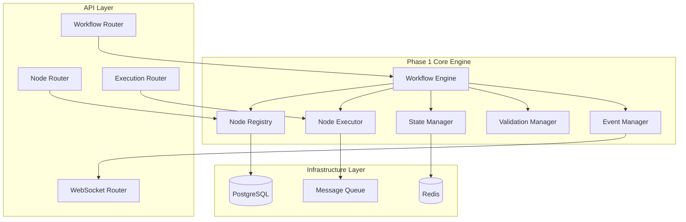
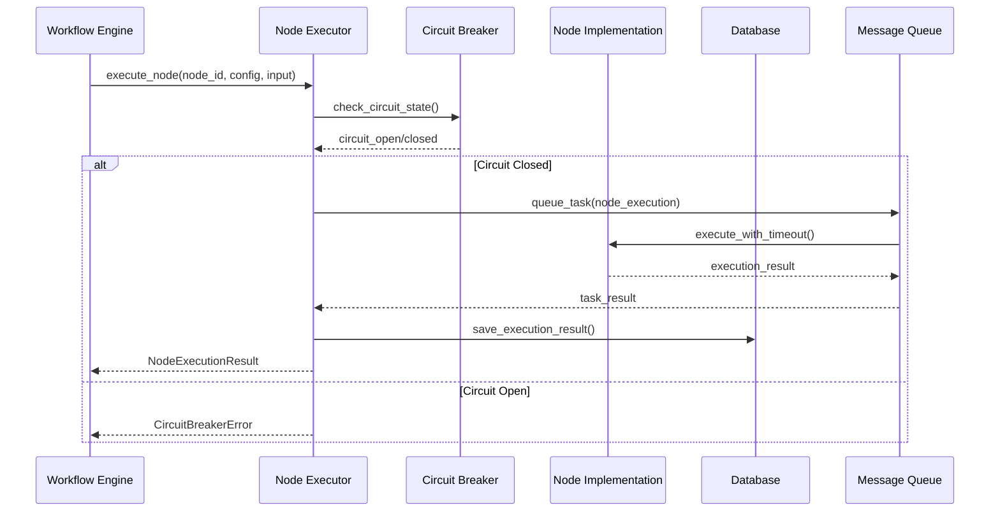
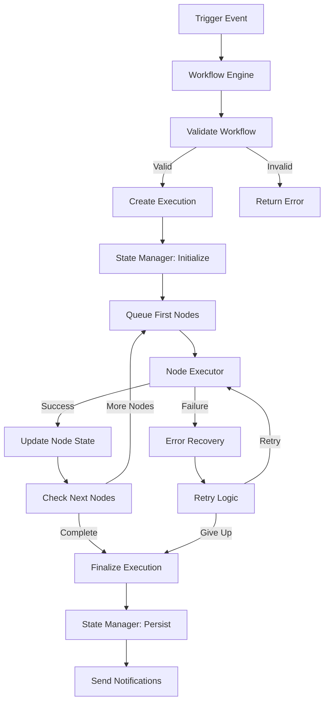
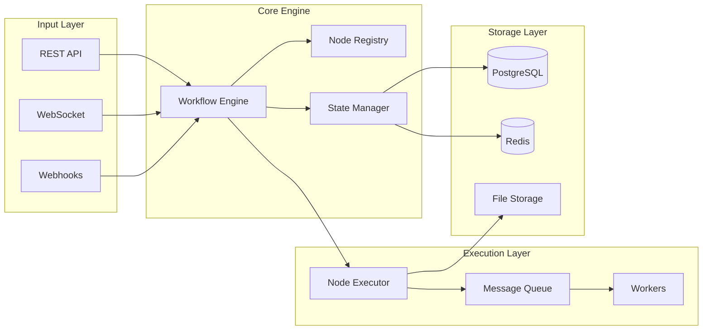

# Phase 1: Core Engine Architecture Specification

## Executive Summary

This document defines the technical architecture for Phase 1 of the ConcertMaster implementation realignment, focusing on the Core Workflow Engine that will serve as the foundation for all subsequent phases. The architecture provides a scalable, modular, and enterprise-ready workflow orchestration platform.

## Current State Analysis

**Alignment Assessment**: 65% → 100% (Phase 1 Target: 85%)
- ✅ Database foundation (PostgreSQL, Redis)
- ✅ API framework (FastAPI)
- ✅ Frontend foundation (React + React Flow)
- ⚠️ Workflow execution engine (partial)
- ❌ Node registry system (missing)
- ❌ State management (incomplete)
- ❌ Real-time monitoring (missing)

## Architecture Overview

### Core Components



## 1. Core Workflow Engine

### 1.1 Workflow Engine Architecture

**File**: `backend/src/core/workflow_engine.py`

```python
class WorkflowEngine:
    """
    Core orchestration engine responsible for workflow lifecycle management,
    execution coordination, and state tracking.
    """
    
    def __init__(self, state_manager: StateManager, node_registry: NodeRegistry):
        self.state_manager = state_manager
        self.node_registry = node_registry
        self.event_manager = EventManager()
        self.metrics_collector = MetricsCollector()
    
    async def execute_workflow(self, workflow_id: UUID, trigger_data: dict) -> ExecutionResult:
        """Execute workflow with distributed state management"""
        
    async def validate_workflow(self, workflow_definition: dict) -> ValidationResult:
        """Validate workflow DAG and node configurations"""
        
    async def pause_execution(self, execution_id: UUID) -> bool:
        """Pause running workflow execution"""
        
    async def resume_execution(self, execution_id: UUID) -> bool:
        """Resume paused workflow execution"""
        
    async def cancel_execution(self, execution_id: UUID) -> bool:
        """Cancel workflow execution with cleanup"""
```

### 1.2 Key Responsibilities

- **Execution Orchestration**: Manages workflow DAG execution order
- **State Coordination**: Coordinates distributed execution state
- **Error Recovery**: Handles execution failures and retry logic
- **Performance Monitoring**: Tracks execution metrics and performance
- **Resource Management**: Manages computational resources and quotas

### 1.3 Technical Specifications

- **Concurrency**: Async/await throughout with asyncio
- **State Storage**: Redis for fast access, PostgreSQL for persistence
- **Error Handling**: Circuit breaker pattern with exponential backoff
- **Monitoring**: Prometheus metrics with custom collectors
- **Scaling**: Horizontal scaling via message queue distribution

## 2. Node Registry System

### 2.1 Registry Architecture

**File**: `backend/src/core/node_registry.py`

```python
class NodeRegistry:
    """
    Dynamic node type management system supporting runtime registration,
    schema validation, and plugin architecture.
    """
    
    def __init__(self, db: AsyncSession, cache: Redis):
        self.db = db
        self.cache = cache
        self.node_types: Dict[str, NodeType] = {}
        self.schemas: Dict[str, JSONSchema] = {}
    
    async def register_node_type(self, node_type: NodeType) -> bool:
        """Register new node type with schema validation"""
        
    async def get_node_type(self, type_name: str) -> Optional[NodeType]:
        """Retrieve node type with caching"""
        
    async def list_node_types(self, category: str = None) -> List[NodeType]:
        """List available node types with optional filtering"""
        
    async def validate_node_config(self, type_name: str, config: dict) -> ValidationResult:
        """Validate node configuration against schema"""
        
    async def get_node_schema(self, type_name: str) -> JSONSchema:
        """Get configuration schema for node type"""
```

### 2.2 Node Type Categories

| Category | Examples | Description |
|----------|----------|-------------|
| **Triggers** | webhook, schedule, form_submit | Workflow initiation points |
| **Transforms** | filter, map, aggregate, format | Data manipulation nodes |
| **Actions** | email, http_request, database_write | Output/effect nodes |
| **Conditions** | if_else, switch, loop, delay | Control flow nodes |
| **Integrations** | slack, github, aws_s3 | External system connectors |

### 2.3 Schema Definition

```json
{
  "node_type": "email_send",
  "category": "actions",
  "version": "1.0.0",
  "schema": {
    "type": "object",
    "properties": {
      "to": {"type": "string", "format": "email"},
      "subject": {"type": "string", "maxLength": 255},
      "body": {"type": "string"},
      "attachments": {
        "type": "array",
        "items": {"type": "string", "format": "uri"}
      }
    },
    "required": ["to", "subject", "body"]
  }
}
```

## 3. Node Execution Runtime

### 3.1 Executor Architecture

**File**: `backend/src/core/node_executor.py`

```python
class NodeExecutor:
    """
    Async node execution runtime with monitoring, error handling,
    and resource management.
    """
    
    def __init__(self, celery_app, metrics_collector: MetricsCollector):
        self.celery = celery_app
        self.metrics = metrics_collector
        self.circuit_breakers: Dict[str, CircuitBreaker] = {}
    
    async def execute_node(
        self, 
        node_id: UUID, 
        node_type: str, 
        config: dict, 
        input_data: dict,
        execution_context: ExecutionContext
    ) -> NodeExecutionResult:
        """Execute individual node with full monitoring"""
        
    async def batch_execute(self, nodes: List[NodeExecution]) -> List[NodeExecutionResult]:
        """Execute multiple nodes in parallel"""
        
    def get_execution_metrics(self, node_type: str) -> ExecutionMetrics:
        """Get performance metrics for node type"""
        
    async def health_check(self) -> HealthStatus:
        """Check executor health status"""
```

### 3.2 Execution Flow



### 3.3 Error Handling Strategy

- **Timeout Management**: Configurable per-node execution timeouts
- **Retry Logic**: Exponential backoff with jitter
- **Circuit Breaker**: Prevent cascade failures
- **Dead Letter Queue**: Handle persistent failures
- **Resource Limits**: CPU/memory limits per execution

## 4. State Management System

### 4.1 State Manager Architecture

**File**: `backend/src/core/state_manager.py`

```python
class StateManager:
    """
    Distributed state management system providing consistency,
    persistence, and real-time updates.
    """
    
    def __init__(self, redis: Redis, postgres: AsyncSession):
        self.redis = redis
        self.postgres = postgres
        self.state_locks: Dict[UUID, asyncio.Lock] = {}
    
    async def create_execution_state(self, execution_id: UUID, workflow_def: dict) -> ExecutionState:
        """Initialize new execution state"""
        
    async def update_node_state(
        self, 
        execution_id: UUID, 
        node_id: UUID, 
        state: NodeState
    ) -> bool:
        """Update individual node execution state"""
        
    async def get_execution_state(self, execution_id: UUID) -> Optional[ExecutionState]:
        """Retrieve complete execution state"""
        
    async def persist_state(self, execution_id: UUID) -> bool:
        """Persist Redis state to PostgreSQL"""
        
    async def cleanup_completed_state(self, execution_id: UUID) -> bool:
        """Clean up completed execution state"""
```

### 4.2 State Schema

```python
@dataclass
class ExecutionState:
    execution_id: UUID
    workflow_id: UUID
    status: ExecutionStatus
    created_at: datetime
    updated_at: datetime
    trigger_data: dict
    execution_context: dict
    node_states: Dict[UUID, NodeState]
    error_info: Optional[ErrorInfo]
    metrics: ExecutionMetrics

@dataclass
class NodeState:
    node_id: UUID
    status: NodeStatus
    input_data: dict
    output_data: Optional[dict]
    error_info: Optional[ErrorInfo]
    execution_time: Optional[float]
    retry_count: int
    started_at: Optional[datetime]
    completed_at: Optional[datetime]
```

### 4.3 Consistency Model

- **Redis Primary**: Fast access for active executions
- **PostgreSQL Secondary**: Persistent storage and auditing
- **State Synchronization**: Async replication with conflict resolution
- **Lock Management**: Distributed locks for state updates
- **Recovery**: Automatic state recovery on system restart

## 5. API Interface Specifications

### 5.1 Workflow Management API

**File**: `backend/src/api/routers/workflow_router.py`

```python
@router.post("/workflows", response_model=WorkflowResponse)
async def create_workflow(workflow: WorkflowCreate) -> WorkflowResponse:
    """Create new workflow with validation"""

@router.post("/workflows/{workflow_id}/execute", response_model=ExecutionResponse)
async def execute_workflow(workflow_id: UUID, trigger_data: dict) -> ExecutionResponse:
    """Execute workflow with trigger data"""

@router.get("/workflows/{workflow_id}/executions", response_model=List[ExecutionResponse])
async def list_executions(workflow_id: UUID, limit: int = 50) -> List[ExecutionResponse]:
    """List workflow executions with pagination"""

@router.get("/executions/{execution_id}", response_model=DetailedExecutionResponse)
async def get_execution_details(execution_id: UUID) -> DetailedExecutionResponse:
    """Get detailed execution information"""

@router.post("/executions/{execution_id}/pause")
async def pause_execution(execution_id: UUID) -> SuccessResponse:
    """Pause running execution"""

@router.post("/executions/{execution_id}/resume")
async def resume_execution(execution_id: UUID) -> SuccessResponse:
    """Resume paused execution"""
```

### 5.2 Node Discovery API

**File**: `backend/src/api/routers/node_router.py`

```python
@router.get("/node-types", response_model=List[NodeTypeResponse])
async def list_node_types(category: str = None) -> List[NodeTypeResponse]:
    """List available node types with optional filtering"""

@router.get("/node-types/{type_name}", response_model=NodeTypeDetailResponse)
async def get_node_type_details(type_name: str) -> NodeTypeDetailResponse:
    """Get detailed node type information including schema"""

@router.get("/node-types/{type_name}/schema", response_model=JSONSchemaResponse)
async def get_node_schema(type_name: str) -> JSONSchemaResponse:
    """Get configuration schema for node type"""

@router.post("/node-types/{type_name}/validate", response_model=ValidationResponse)
async def validate_node_config(type_name: str, config: dict) -> ValidationResponse:
    """Validate node configuration against schema"""
```

### 5.3 Real-time Updates API

**File**: `backend/src/api/routers/websocket_router.py`

```python
@router.websocket("/ws/executions/{execution_id}")
async def execution_websocket(websocket: WebSocket, execution_id: UUID):
    """WebSocket endpoint for real-time execution updates"""
    
@router.websocket("/ws/workflows/{workflow_id}")
async def workflow_websocket(websocket: WebSocket, workflow_id: UUID):
    """WebSocket endpoint for workflow-level updates"""
```

## 6. Database Schema Enhancements

### 6.1 New Tables

```sql
-- Workflow execution tracking
CREATE TABLE workflow_executions (
    id UUID PRIMARY KEY DEFAULT gen_random_uuid(),
    workflow_id UUID NOT NULL REFERENCES workflows(id),
    status execution_status NOT NULL DEFAULT 'pending',
    trigger_data JSONB,
    execution_context JSONB,
    error_info JSONB,
    created_at TIMESTAMP WITH TIME ZONE DEFAULT NOW(),
    started_at TIMESTAMP WITH TIME ZONE,
    completed_at TIMESTAMP WITH TIME ZONE,
    organization_id UUID NOT NULL REFERENCES organizations(id)
);

-- Individual node execution tracking
CREATE TABLE node_executions (
    id UUID PRIMARY KEY DEFAULT gen_random_uuid(),
    workflow_execution_id UUID NOT NULL REFERENCES workflow_executions(id),
    node_id UUID NOT NULL,
    node_type VARCHAR(255) NOT NULL,
    status node_execution_status NOT NULL DEFAULT 'pending',
    input_data JSONB,
    output_data JSONB,
    configuration JSONB NOT NULL,
    error_info JSONB,
    execution_time_ms INTEGER,
    retry_count INTEGER DEFAULT 0,
    started_at TIMESTAMP WITH TIME ZONE,
    completed_at TIMESTAMP WITH TIME ZONE,
    created_at TIMESTAMP WITH TIME ZONE DEFAULT NOW()
);

-- Node type registry
CREATE TABLE node_types (
    id UUID PRIMARY KEY DEFAULT gen_random_uuid(),
    name VARCHAR(255) NOT NULL UNIQUE,
    category VARCHAR(100) NOT NULL,
    version VARCHAR(50) NOT NULL,
    schema JSONB NOT NULL,
    implementation_class VARCHAR(500) NOT NULL,
    description TEXT,
    icon VARCHAR(255),
    is_enabled BOOLEAN DEFAULT true,
    created_at TIMESTAMP WITH TIME ZONE DEFAULT NOW(),
    updated_at TIMESTAMP WITH TIME ZONE DEFAULT NOW()
);

-- Execution metrics for performance monitoring
CREATE TABLE execution_metrics (
    id UUID PRIMARY KEY DEFAULT gen_random_uuid(),
    execution_id UUID NOT NULL REFERENCES workflow_executions(id),
    metric_name VARCHAR(255) NOT NULL,
    metric_value NUMERIC NOT NULL,
    metric_type VARCHAR(100) NOT NULL, -- 'counter', 'gauge', 'histogram'
    labels JSONB,
    recorded_at TIMESTAMP WITH TIME ZONE DEFAULT NOW()
);
```

### 6.2 Enhanced Indexes

```sql
-- Performance optimization indexes
CREATE INDEX idx_workflow_executions_status_created ON workflow_executions(status, created_at);
CREATE INDEX idx_node_executions_workflow_status ON node_executions(workflow_execution_id, status);
CREATE INDEX idx_node_executions_type_status ON node_executions(node_type, status);
CREATE INDEX idx_execution_metrics_execution_name ON execution_metrics(execution_id, metric_name);

-- Full-text search indexes
CREATE INDEX idx_node_types_search ON node_types USING gin(to_tsvector('english', name || ' ' || description));
```

## 7. Component Interaction Patterns

### 7.1 Workflow Execution Flow



### 7.2 Data Flow Architecture



### 7.3 Event-Driven Architecture

- **Event Types**: execution_started, node_completed, execution_failed, state_changed
- **Event Publisher**: EventManager with Redis pub/sub
- **Event Subscribers**: WebSocket handlers, notification services, metrics collectors
- **Event Schema**: Structured JSON with version compatibility

## 8. Performance & Scalability Considerations

### 8.1 Performance Targets

| Metric | Target | Monitoring |
|--------|--------|------------|
| Workflow Execution Start | <2s | Prometheus histogram |
| Node Execution Average | <5s | Per-node type metrics |
| API Response Time | <200ms | Request duration metrics |
| Database Query Time | <100ms | SQLAlchemy instrumentation |
| WebSocket Latency | <50ms | Connection metrics |
| Memory Usage | <500MB per worker | Resource monitoring |

### 8.2 Scaling Strategy

**Horizontal Scaling**:
- Multiple workflow engine instances with load balancing
- Celery workers can scale independently based on queue depth
- Redis Cluster for state management scaling
- Read replicas for PostgreSQL performance

**Vertical Scaling**:
- Configurable worker concurrency per instance
- Database connection pool sizing
- Redis memory optimization
- Async I/O optimization throughout stack

### 8.3 Caching Strategy

- **Node Type Registry**: Cache in Redis with TTL
- **Workflow Definitions**: Cache frequently accessed workflows
- **Execution State**: Primary in Redis, backup in PostgreSQL
- **API Responses**: Cache static responses (node schemas, types)

## 9. Security Architecture

### 9.1 Execution Security

- **Sandboxed Execution**: Node executions run in isolated environments
- **Resource Limits**: CPU, memory, and execution time limits
- **Input Validation**: Comprehensive validation of all node inputs
- **Output Sanitization**: Clean output data before passing to next node
- **Audit Trail**: Complete execution logging and audit capabilities

### 9.2 State Security

- **Encryption**: Sensitive data encrypted at rest and in transit
- **Access Control**: Role-based access to execution states
- **State Isolation**: Multi-tenant state isolation
- **Backup Security**: Encrypted backups with key rotation

### 9.3 API Security

- **Authentication**: JWT tokens for all API endpoints
- **Authorization**: Fine-grained permissions for workflow operations
- **Rate Limiting**: Per-user and per-organization rate limits
- **Input Validation**: Comprehensive request validation

## 10. Monitoring & Observability

### 10.1 Metrics Collection

```python
# Key Performance Indicators
WORKFLOW_EXECUTION_DURATION = Histogram('workflow_execution_duration_seconds')
NODE_EXECUTION_DURATION = Histogram('node_execution_duration_seconds', ['node_type'])
EXECUTION_STATUS_COUNTER = Counter('workflow_executions_total', ['status'])
ACTIVE_EXECUTIONS_GAUGE = Gauge('active_workflow_executions')
ERROR_RATE_COUNTER = Counter('workflow_errors_total', ['error_type'])
```

### 10.2 Logging Strategy

- **Structured Logging**: JSON format with correlation IDs
- **Log Levels**: DEBUG (development), INFO (execution events), WARN (recoverable issues), ERROR (failures)
- **Context Preservation**: Full execution context in all log entries
- **Performance Logging**: Execution timing and resource usage

### 10.3 Health Checks

```python
@router.get("/health")
async def health_check() -> HealthResponse:
    """Comprehensive system health check"""
    return {
        "status": "healthy",
        "components": {
            "database": await check_database_health(),
            "redis": await check_redis_health(),
            "message_queue": await check_queue_health(),
            "node_executor": await check_executor_health()
        }
    }
```

## 11. Implementation Timeline

### Week 1: Foundation
- [ ] Core workflow engine structure
- [ ] Node registry base implementation
- [ ] Database schema migrations
- [ ] Basic API endpoints

### Week 2: Execution Engine
- [ ] Node executor implementation
- [ ] State management system
- [ ] Error handling and retry logic
- [ ] WebSocket integration

### Week 3: API Completion & Testing
- [ ] Complete workflow CRUD operations
- [ ] Node discovery endpoints
- [ ] Real-time status updates
- [ ] Comprehensive testing suite

## 12. Success Criteria

### Technical Criteria
- [ ] All core components implemented and tested
- [ ] 95%+ test coverage for core engine
- [ ] Performance targets achieved
- [ ] Security requirements met
- [ ] API documentation complete

### Functional Criteria
- [ ] Workflow execution from trigger to completion
- [ ] Real-time execution monitoring
- [ ] Error handling and recovery
- [ ] Node type discovery and validation
- [ ] State persistence and recovery

### Quality Criteria
- [ ] Code review approval for all components
- [ ] Load testing passed
- [ ] Security audit completed
- [ ] Documentation reviewed
- [ ] Integration tests passing

This architecture provides the foundation for a scalable, reliable, and maintainable workflow orchestration platform that will serve as the basis for all subsequent development phases.